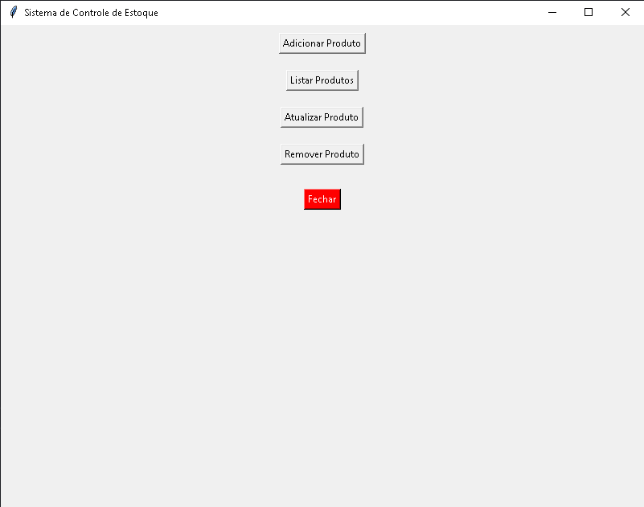

# Sistema de Estoque com Interface Gráfica Básica Interligado ao MySQL em Python

O sistema em questão faz um Sistema de cadastramento, listagem, atualização e exclusão de produtos no Estoque. O sistema apresenta uma interface simples para integrar os dados de Estoque ao um armazenamento em um Banco de Dados MySQL. O sistema conta com operações simples, mas de grande utilidade para armazenamento de grandes quantidades de produtos em estoque.




## Instalação do Tkinter pelo cmd


```bash
 python -m tkinter
```


## Bibliotecas usada


```bash
 import tkinter as tk

 import mysql.connector

 from tkinter import messagebox
 
```
    
## Melhorias Futuras

Para ideias futuras está no aperfeiçoamento do código, integralização de uma interface robusta que tenha melhores funcionalidades e que tenha facilidade de o usuário interagir de forma mais simples. Há também maneiras de otimização de código, como fazer melhorias de atualização dos Produtos dentro do Estoque. Adicionar novas ferramentas para o sistema de Estoque.

## Funcionalidades

- Criação de Banco de Dados e legibilidade na performace do código
- Uso Tkinter para uma interface gráfica interativa com o usuário
- Sistema de Registro/Atualização/Listagem e Remoção de Produtos do Estoque no Banco de Dados


